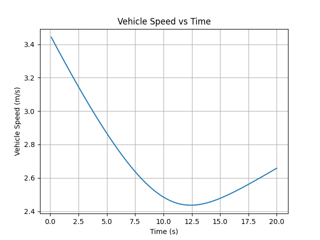
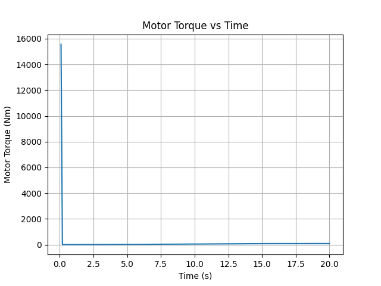

# EV Powertrain Root Cause Analysis

This project presents a system-level Root Cause Analysis (RCA) of performance degradation in an Electric Vehicle (EV) powertrain using Python-based modeling and simulation.

## Project Overview
The EV powertrain consists of a battery, inverter, electric motor, and vehicle longitudinal dynamics. Initial simulations showed unstable and oscillatory behavior in motor torque and vehicle speed.

A structured root cause analysis revealed that the instability was not caused by the electrical subsystem, but by the absence of vehicle inertia and proper longitudinal dynamics modeling.

## Key Features
- System-level EV powertrain model
- Root cause identification using simulation results
- Physics-based vehicle dynamics modeling
- Stable performance validation using plots
- Fully implemented using open-source tools (no MATLAB)

## Tools & Technologies
- Python 3
- NumPy
- Matplotlib

## Project Structure
models/        # Battery, inverter, motor, vehicle models  
simulation/    # Simulation and plotting scripts  
*.png          # Result plots  
*.docx         # Detailed project documentation  

## Results
- Stable vehicle speed response
- Realistic motor torque behavior
- Elimination of oscillatory instability

## Graphical Results

### Vehicle Speed vs Time

### Motor Torque vs Time

## Conclusion
The project demonstrates that performance degradation in EV powertrains can originate from improper mechanical system modeling rather than electrical subsystem limitations. Incorporating vehicle inertia successfully restored stable operation.

## Future Scope
- Battery degradation modeling
- Drive cycle-based simulation
- Fault injection and diagnostics
